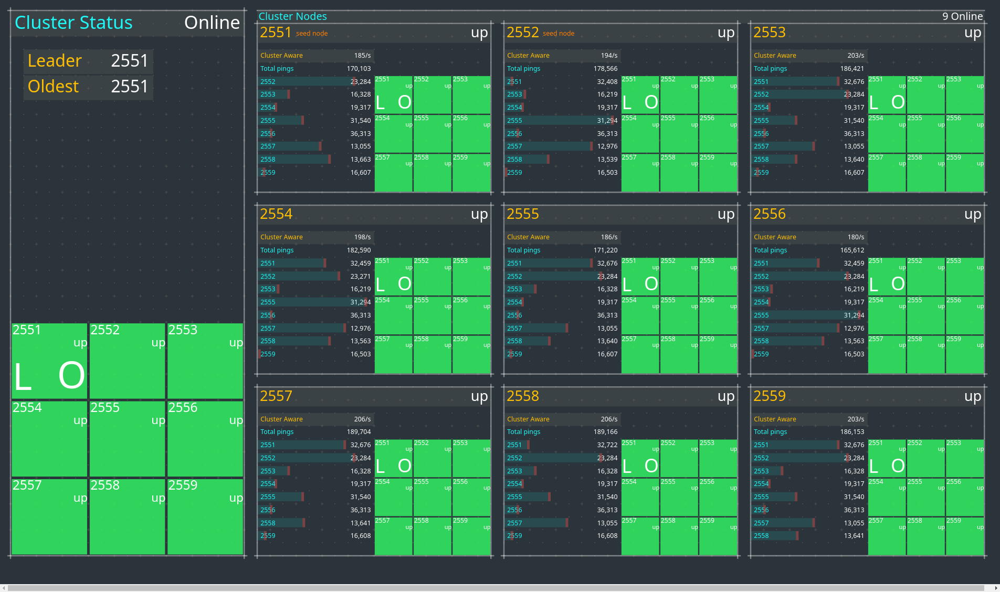
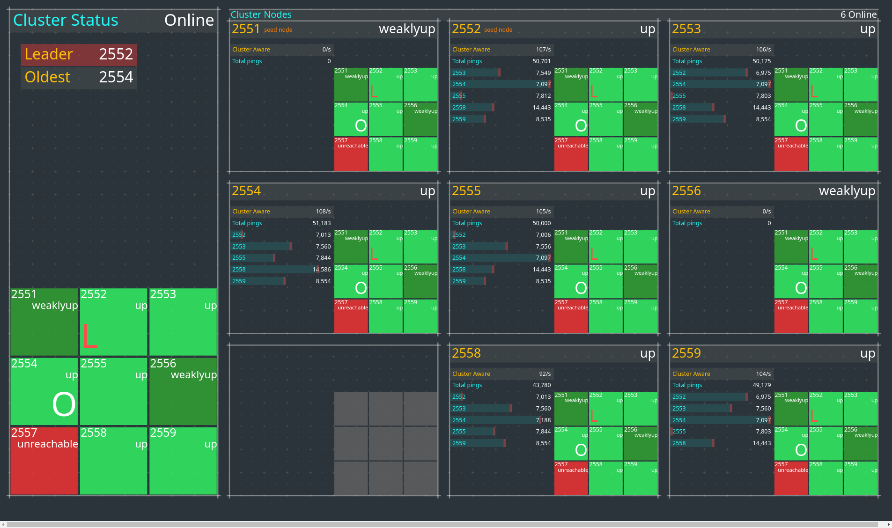

## Akka Typed Java Cluster Aware Example

### Introduction

This is a Java, Maven, Akka project that demonstrates how to setup a basic
[Akka Cluster](https://doc.akka.io/docs/akka/current/typed/index-cluster.html).

This project is one in a series of projects that starts with a simple Akka Cluster project and progressively builds up to examples of event sourcing and command query responsibility segregation.

The project series is composed of the following GitHub repos:
* [akka-typed-java-cluster](https://github.com/mckeeh3/akka-typed-java-cluster)
* [akka-typed-java-cluster-sbr](https://github.com/mckeeh3/akka-typed-java-cluster-sbr)
* [akka-typed-java-cluster-aware](https://github.com/mckeeh3/akka-typed-java-cluster-aware) (this project)
* [akka-typed-java-cluster-singleton](https://github.com/mckeeh3/akka-typed-java-cluster-singleton) (coming soon)
* [akka-typed-java-cluster-sharding](https://github.com/mckeeh3/akka-typed-java-cluster-sharding) (coming soon)
* [akka-typed-java-cluster-persistence](https://github.com/mckeeh3/akka-typed-java-cluster-persistence) (coming soon)
* [akka-typed-java-cluster-persistence-query](https://github.com/mckeeh3/akka-typed-java-cluster-persistence-query) (coming soon)

Each project can be cloned, built, and runs independently of the other projects.

### About Akka Clustering Awareness

Before we get into the details of how this project is set up as a cluster-aware example, let's first use a simple example scenario. In this example, we'll use a basic chat room app. As people enter the chat room, they can see who else is in the chat room. Every person in the chat room is given a simple set of instructions, send a message with the word "ping" every minute to all of the other people currently in the chat room. When you receive a "ping" message, respond to the sender with a "pong" message.

In this example, each person in the chat room is essentially a simple actor following a simple set of instructions. Also, each person is aware of who else is in the chat room and that all of the other participants follow the same set of instructions.

This example scenario is similar to the fundamental approach used by cluster-aware actors. Cluster-aware actor classes are implemented to expect an instance of the actor running on each node in a cluster.

A receptionist is used to facilitate this type of messaging behavior. The [Akka Receptionist](https://doc.akka.io/docs/akka/current/typed/actor-discovery.html#receptionist) provides the ability for actors to be aware of other actors located on nodes across the cluster. The receptionist's basic functionality is that other actors send the receptionist messages that are used to register actors and to subscribe to receive messages from the receptionist when actors register and drop from the registration list.

Message routing is the most common cluster-aware usage pattern. Messages sent to cluster-aware router actors are forwarded to other actors that are distributed across the cluster. For example, router actors work in conjunction with worker actors. Messages contain a worker identifier. These messages may be sent to any of the router actors running on each node in the cluster. When a router actor receives each message, it looks at the worker id provided in the message to determine if the message should be routed to a local or remote worker actor. If the message is for a local actor, the router forwards it to the local worker. For messages that belong to remote workers, the router forwards the message to the remote router actor responsible for handling messages for the targeted worker actor. When the remote router actor receives the forwarded message, it goes through the same routing process.

This project includes a simple cluster-aware actor that periodically sends ping messages and responds to ping messages with pong messages sent back to the pinger. The key thing to understand that this messaging is happening between Akka cluster nodes, each node is running as a separate JVM, and the messages are sent over the network.

~~~java
package cluster;

import akka.actor.Address;
import akka.actor.typed.ActorRef;
import akka.actor.typed.Behavior;
import akka.actor.typed.javadsl.*;
import akka.actor.typed.receptionist.Receptionist;
import akka.actor.typed.receptionist.ServiceKey;
import akka.cluster.Member;
import akka.cluster.MemberStatus;
import akka.cluster.typed.Cluster;
import com.fasterxml.jackson.annotation.JsonCreator;
import org.slf4j.Logger;
import scala.Option;

import java.io.Serializable;
import java.time.Duration;
import java.util.*;
import java.util.function.Consumer;
import java.util.stream.Collectors;
import java.util.stream.IntStream;
import java.util.stream.StreamSupport;

public class ClusterAwareActor extends AbstractBehavior<ClusterAwareActor.Message> {
  private final PingStatistics pingStatistics = new PingStatistics();
  private final ActorRef<HttpServer.PingStatistics> httpServerActor;
  private Set<ActorRef<Message>> serviceInstances;
  private static final Duration tickInterval = Duration.ofMillis(500);

  static final ServiceKey<Message> serviceKey = ServiceKey.create(Message.class, ClusterAwareActor.class.getSimpleName());

  private ClusterAwareActor(ActorContext<Message> context, TimerScheduler<Message> timers, ActorRef<HttpServer.PingStatistics> httpServerActor) {
    super(context);
    this.httpServerActor = httpServerActor;

    receptionistRegisterSubscribe(context);
    timers.startTimerAtFixedRate(Tick.Instance, tickInterval);
  }

  @Override
  public Receive<Message> createReceive() {
    return newReceiveBuilder()
        .onMessage(Listeners.class, this::onListeners)
        .onMessage(Tick.class, notUsed -> onTick())
        .onMessage(Ping.class, this::onPing)
        .onMessage(Pong.class, this::onPong)
        .build();
  }

  static Behavior<Message> create(ActorRef<HttpServer.PingStatistics> httpServerActor) {
    return Behaviors.setup(context ->
        Behaviors.withTimers(timers ->
            new ClusterAwareActor(context, timers, httpServerActor)));
  }

  private void receptionistRegisterSubscribe(ActorContext<Message> context) {
    final ActorRef<Receptionist.Listing> listingActorRef = context.messageAdapter(Receptionist.Listing.class, Listeners::new);

    context.getSystem().receptionist()
        .tell(Receptionist.register(serviceKey, context.getSelf()));
    context.getSystem().receptionist()
        .tell(Receptionist.subscribe(serviceKey, listingActorRef));
  }

  private Behavior<Message> onListeners(Listeners listeners) {
    serviceInstances = listeners.listing.getServiceInstances(serviceKey);
    pingStatistics.clearOfflineNodeCounters(serviceInstances);

    log().info("Cluster aware actors subscribers changed, count {}", serviceInstances.size());
    serviceInstances
        .forEach(new Consumer<ActorRef<Message>>() {
          int i = 0;

          @Override
          public void accept(ActorRef<Message> messageActorRef) {
            log().info("{} {}{}", ++i, self(messageActorRef), messageActorRef);
          }

          private String self(ActorRef<Message> clusterAwareActorRef) {
            return clusterAwareActorRef.equals(getContext().getSelf()) ? "(SELF) " : "";
          }
        });

    return Behaviors.same();
  }

  private Behavior<Message> onTick() {
    pingUpColleagues();
    httpServerActor.tell(new HttpServer.PingStatistics(
        pingStatistics.totalPings,
        Collections.unmodifiableMap(pingStatistics.nodePings)));
    return Behaviors.same();
  }

  private Behavior<Message> onPing(Ping ping) {
    log().info("<=={}", ping);
    ping.replyTo.tell(new Pong(getContext().getSelf(), ping.start));
    pingStatistics.ping(ping.replyTo);
    return Behaviors.same();
  }

  private Behavior<Message> onPong(Pong pong) {
    log().info("<--{}", pong);
    return Behaviors.same();
  }

  private void pingUpColleagues() {
    final ActorContext<Message> context = getContext();

    if (iAmUp()) {
      final int size = serviceInstances.size() - 1;
      log().info("Tick, ping {}", Math.max(size, 0));

      final List<Address> upMembers = getUpMembers();

      serviceInstances.stream()
          .filter(clusterAwareActorRef -> !clusterAwareActorRef.equals(context.getSelf()))
          .filter(clusterAwareActorRef -> upMembers.contains(clusterAwareActorRef.path().address()))
          .forEach(clusterAwareActorRef -> clusterAwareActorRef.tell(new Ping(context.getSelf(), System.nanoTime())));
    } else {
      log().info("Tick, no pings, this node is not up, {}", Cluster.get(context.getSystem()).selfMember());
    }
  }

  private boolean iAmUp() {
    return Cluster.get(getContext().getSystem()).selfMember().status().equals(MemberStatus.up());
  }

  private List<Address> getUpMembers() {
    final Iterable<Member> members = Cluster.get(getContext().getSystem()).state().getMembers();
    return StreamSupport.stream(members.spliterator(), false)
        .filter(member -> MemberStatus.up().equals(member.status()))
        .map(Member::address)
        .collect(Collectors.toList());
  }

  private Logger log() {
    return getContext().getLog();
  }

  public interface Message {
  }

  private static class Listeners implements Message {
    final Receptionist.Listing listing;

    private Listeners(Receptionist.Listing listing) {
      this.listing = listing;
    }
  }

  public static class Ping implements Message, Serializable {
    public final ActorRef<Message> replyTo;
    public final long start;

    @JsonCreator
    public Ping(ActorRef<Message> replyTo, long start) {
      this.replyTo = replyTo;
      this.start = start;
    }

    @Override
    public String toString() {
      return String.format("%s[%s]", getClass().getSimpleName(), replyTo.path());
    }
  }

  public static class Pong implements Message, Serializable {
    public final ActorRef<Message> replyFrom;
    public final long pingStart;

    @JsonCreator
    public Pong(ActorRef<Message> replyFrom, long pingStart) {
      this.replyFrom = replyFrom;
      this.pingStart = pingStart;
    }

    @Override
    public String toString() {
      return String.format("%s[%s, %,dns]", getClass().getSimpleName(), replyFrom.path(), System.nanoTime() - pingStart);
    }
  }

  enum Tick implements Message {
    Instance
  }

  static class PingStatistics {
    int totalPings = 0;
    Map<Integer, Integer> nodePings = new HashMap<>();

    PingStatistics() {
      IntStream.rangeClosed(2551, 2559).forEach(p -> nodePings.put(p, 0));
    }

    void ping(ActorRef<Message> actorRef) {
      ++totalPings;

      final int port = actorRefPort(actorRef);
      if (port >= 2551 && port <= 2559) {
        nodePings.put(port, 1 + nodePings.getOrDefault(port, 0));
      }
    }

    void clearOfflineNodeCounters(Set<ActorRef<Message>> serviceInstances) {
      final List<Integer> ports = new ArrayList<>();
      IntStream.rangeClosed(2551, 2559).forEach(ports::add);

      serviceInstances.forEach(actorRef -> ports.removeIf(p -> p == actorRefPort(actorRef)));
      ports.forEach(port -> nodePings.replace(port, 0));
    }

    private static int actorRefPort(ActorRef<Message> actorRef) {
      final Option<Object> port = actorRef.path().address().port();
      return port.isDefined()
          ? Integer.parseInt(port.get().toString())
          : -1;
    }
  }
}
~~~

The full class file of this example cluster-aware actor is shown above. First, let's take a look at the method that handles incoming messages.

The constructor calls the `receptionistRegisterSubscribe` method. This method sends two messages to the
[Akka Receptionist](https://doc.akka.io/docs/akka/current/typed/actor-discovery.html#receptionist).

~~~java
private void receptionistRegisterSubscribe(ActorContext<Message> context) {
  final ActorRef<Receptionist.Listing> listingActorRef = context.messageAdapter(Receptionist.Listing.class, Listeners::new);

  context.getSystem().receptionist()
      .tell(Receptionist.register(serviceKey, context.getSelf()));
  context.getSystem().receptionist()
      .tell(Receptionist.subscribe(serviceKey, listingActorRef));
}
~~~

The first message tells the receptionist to register this actor instance with the specified service key. The receptionist provides a way for actors to be discoverable by other actors across the cluster. The second message tells the receptionist that this actor wants to subscribe to registration changes for the same specified service key.

Going back to the chat example, as users enter the chat room, they register themselves, and they also subscribe to changes to the chat room users list. The registration action triggers sending notifications to everyone currently in the room that you have joined.

Messages sent to this actor are defined in the `createReceive` method.

~~~java
@Override
public Receive<Message> createReceive() {
  return newReceiveBuilder()
      .onMessage(Listeners.class, this::onListeners)
      .onMessage(Tick.class, notUsed -> onTick())
      .onMessage(Ping.class, this::onPing)
      .onMessage(Pong.class, this::onPong)
      .build();
}
~~~

Note that there are four message types, a listeners message, a tick message, and the ping and pong messages. We already have an idea what is going on with ping and pong, but what about the listeners and tick messages?

The listeners messages inform this actor instance that the list of registered actors has changed. When these messages are received, it triggers an update of the list of registered actors maintained in the `PingStatistics` class located at the end of the source listing above.

The tick message is based on another common actor messaging pattern where an actor uses an Akka messaging scheduling feature. When an instance of this actor is created, it creates a fixed rate scheduler.

~~~java
  timers.startTimerAtFixedRate(Tick.Instance, tickInterval);
~~~

On a specified interval, a tick message is sent to this actor instance. Each tick message triggers send ping messages to all of the other registered actor instances.

~~~java
private Behavior<Message> onTick() {
  pingUpColleagues();
  httpServerActor.tell(new HttpServer.PingStatistics(
      pingStatistics.totalPings,
      Collections.unmodifiableMap(pingStatistics.nodePings)));
  return Behaviors.same();
}
~~~

The `pingUpColleagues` method does the heavy lifting. It is responsible for only sending ping messages to the other registered actors that are running on Akka cluster nodes in an "up" state. Also, note that a message is sent to the HTTP server actor passing along a message that contains ping statistics that are shown on the dashboard.

The `onPing` method is invoked When a ping message is received.

~~~java
private Behavior<Message> onPing(Ping ping) {
  log().info("<=={}", ping);
  ping.replyTo.tell(new Pong(getContext().getSelf(), ping.start));
  pingStatistics.ping(ping.replyTo);
  return Behaviors.same();
}
~~~

These incoming messages trigger a reply pong message to the sender. The ping statistics are also updated.

Finally, pong messages received in response to previous ping messages sent from this actor instance, are logged when received.

~~~java
private Behavior<Message> onPong(Pong pong) {
  log().info("<--{}", pong);
  return Behaviors.same();
}
~~~

### Installation

~~~bash
$ git clone https://github.com/mckeeh3/akka-typed-java-cluster-aware.git
$ cd akka-typed-java-cluster-aware
$ mvn clean package
~~~

The Maven command builds the project and creates a self contained runnable JAR.

### Run a cluster (Mac, Linux, Cygwin)

The project contains a set of scripts that can be used to start and stop individual cluster nodes or start and stop a cluster of nodes.

The main script `./akka` is provided to run a cluster of nodes or start and stop individual nodes.

~~~bash
$ ./akka
~~~
Run the akka script with no parameters to see the available options.
~~~
This CLI is used to start, stop and view the dashboard nodes in an Akka cluster.

These commands manage the Akka cluster as defined in this project. A cluster
of nodes is started using the JAR file built with the project Maven POM file.

Cluster commands are used to start, stop, view status, and view the dashboard Akka cluster nodes.

./akka cluster start N | stop | status | dashboard [N]
./akka cluster start [N]      # Starts one or more cluster nodes as specified by [N] or default 9, which must be 1-9.
./akka cluster stop           # Stops all currently cluster nodes.
./akka cluster status         # Shows an Akka Management view of the cluster status/state.
./akka cluster dashboard [N]  # Opens an Akka cluster dashboard web page hosted on the specified [N] or default 1, which must be 1-9.

Node commands are used to start, stop, kill, down, or tail the log of cluster nodes.
Nodes are started on port 255N and management port 855N, N is the node number 1-9.

./akka node start N | stop N | kill N | down N | tail N
./akka node start N...  # Start one or more cluster nodes for nodes 1-9.
./akka node stop N...   # Stop one or more cluster nodes for nodes 1-9.
./akka node kill N...   # Kill (kill -9) one or more cluster nodes for nodes 1-9.
./akka node down N...   # Down one or more cluster nodes for nodes 1-9.
./akka node tail N      # Tail the log file of the specified cluster node for nodes 1-9.

Net commands are used to block and unblock network access to cluster nodes.

./akka net block N | unblock | view | enable | disable
./akka net block N...  # Block network access to node ports, ports 255N, nodes N 1-9.
./akka net unblock     # Reset the network blocking rules.
./akka net view        # View the current network blocking rules.
./akka net enable      # Enable packet filtering, which enables blocking network access to cluster nodes. (OSX only)
./akka net disable     # Disable packet filtering, which disables blocking network access to cluster nodes. (OSX only)
~~~

The `cluster` and `node` start options will start Akka nodes on ports 2551 through 2559.
Both `stdin` and `stderr` output is sent to a log files in the `/tmp` directory using the file naming convention `/tmp/<project-dir-name>-N.log`.

Start a cluster of nine nodes running on ports 2551 to 2559.
~~~bash
$ ./akka cluster start
Starting 9 cluster nodes
Start node 1 on port 2551, management port 8551, HTTP port 9551
Start node 2 on port 2552, management port 8552, HTTP port 9552
Start node 3 on port 2553, management port 8553, HTTP port 9553
Start node 4 on port 2554, management port 8554, HTTP port 9554
Start node 5 on port 2555, management port 8555, HTTP port 9555
Start node 6 on port 2556, management port 8556, HTTP port 9556
Start node 7 on port 2557, management port 8557, HTTP port 9557
Start node 8 on port 2558, management port 8558, HTTP port 9558
Start node 9 on port 2559, management port 8559, HTTP port 9559
~~~

Stop all currently running cluster nodes.
~~~bash
$ ./akka cluster stop
Stop node 1 on port 2551
Stop node 2 on port 2552
Stop node 3 on port 2553
Stop node 4 on port 2554
Stop node 5 on port 2555
Stop node 6 on port 2556
Stop node 7 on port 2557
Stop node 8 on port 2558
Stop node 9 on port 2559
~~~

Stop node 3 on port 2553.
~~~bash
$ ./akka node stop 3
Stop node 3 on port 2553
~~~

Stop nodes 5 and 7 on ports 2555 and 2557.
~~~bash
$ ./akka node stop 5 7
Stop node 5 on port 2555
Stop node 7 on port 2557
~~~

Start node 3, 5, and 7 on ports 2553, 2555 and2557.
~~~bash
$ ./akka node start 3 5 7
Start node 3 on port 2553, management port 8553, HTTP port 9553
Start node 5 on port 2555, management port 8555, HTTP port 9555
Start node 7 on port 2557, management port 8557, HTTP port 9557
~~~

Start a cluster of four nodes on ports 2551, 2552, 2553, and 2554.
~~~bash
$ ./akka cluster start 4
Starting 4 cluster nodes
Start node 1 on port 2551, management port 8551, HTTP port 9551
Start node 2 on port 2552, management port 8552, HTTP port 9552
Start node 3 on port 2553, management port 8553, HTTP port 9553
Start node 4 on port 2554, management port 8554, HTTP port 9554
~~~

Again, stop all currently running cluster nodes.
~~~bash
$ ./akka cluster stop
~~~

The `./akka cluster status` command displays the status of a currently running cluster in JSON format using the
[Akka Management](https://developer.lightbend.com/docs/akka-management/current/index.html)
extension
[Cluster Http Management](https://developer.lightbend.com/docs/akka-management/current/cluster-http-management.html).

### The Cluster Dashboard ###

Included in this project is a cluster dashboard. The dashboard visualizes live information about a running cluster.  

~~~bash
$ git clone https://github.com/mckeeh3/akka-typed-java-cluster.git
$ cd akka-typed-java-cluster
$ mvn clean package
$ ./akka cluster start
$ ./akka cluster dashboard
~~~
Follow the steps above to download, build, run, and bring up a dashboard in your default web browser.

The following sequence of commands changes the cluster state as shown below.

~~~bash
$ ./akka node stop 1 6    
Stop node 1 on port 2551
Stop node 6 on port 2556

$ ./akka node kill 7  
Kill node 7 on port 2557

$ ./akka node start 1 6  
Start node 1 on port 2551, management port 8551, HTTP port 9551
Start node 6 on port 2556, management port 8556, HTTP port 9556
~~~

Note that node 1 and 6 remain in a "weekly up" state. (You can learn more about Akka clusters in the
[Cluster Specification](https://doc.akka.io/docs/akka/current/typed/cluster-concepts.html#cluster-specification)
and the
[Cluster Membership Service](https://doc.akka.io/docs/akka/current/typed/cluster-membership.html#cluster-membership-service)
documentation)

Also note that the
[leader](https://doc.akka.io/docs/akka/current/typed/cluster-membership.html#leader),
indicated by the "L" moves from node 1 to 2. The leader "L" is red, which indicates that one or more nodes are in an unreachable state. While in this state the leader will not promote nodes to an "up" state. This is the reason why in the above example new nodes remain in a weakly up state.

The [oldest node](https://doc.akka.io/docs/akka/current/typed/cluster-singleton.html#singleton-manager),
indicated by the "O" in node 5, moved from node 1 to node 5. The visualization of the cluster state changes is shown in the dashboard as they happen.

### How the Cluster Dashboard Works ###

When the dashboard web page loads, it kicks off included JavaScript code used to render the dashboard web page. The
[p5.js JavaScript library](https://p5js.org/)
does most of the actual rendering of running Akka clusters.

The dashboard layout on the left shows the current state of the cluster from the perspective of the current leader node. Please see the
[Leader documentation](https://doc.akka.io/docs/akka/current/typed/cluster-membership.html#leader)
for more details about its role in the cluster. That said, the leader node is not that significant; it is NOT a cluster master node.

The left panel also shows Leader node port and the Oldest node port. The Leader node is responsible for making cluster state changes. The Oldest node is of interest when using
[cluster singleton actors](https://doc.akka.io/docs/akka/current/typed/cluster-singleton.html#singleton-manager).
Cluster singletons will be covered in more detail in the
[akka-typed-java-cluster-singleton](https://github.com/mckeeh3/akka-typed-java-cluster-singleton)
project in this series.

The right-hand side of the dashboard shows the current state of the cluster from the perspective of each of the currently running cluster nodes. The dashboard asks each node for its current view of the cluster. The JavaScript in the dashboard sends an HTTP request to each of the nine nodes in the cluster. The currently running nodes each return a JSON response that contains that node's state and what it knows about the current state of the cluster.

~~~java
private static void startupClusterNodes(List<String> ports) {
    System.out.printf("Start cluster on port(s) %s%n", ports);

    ports.forEach(port -> {
        ActorSystem<Void> actorSystem = ActorSystem.create(Main.create(), "cluster", setupClusterNodeConfig(port));
        AkkaManagement.get(actorSystem.classicSystem()).start();
        HttpServer.start(actorSystem);
    });
}
~~~

The server-side that responds to the incoming HTTP requests from the client-side JavaScript is handled in the `HttpServer` class. As shown above, the `Runner` class creates an instance of the `HttpServer` class.

~~~java
private HttpResponse handleHttpRequest(HttpRequest httpRequest) {
    //log().info("HTTP request '{}'", httpRequest.getUri().path());
    switch (httpRequest.getUri().path()) {
        case "/":
            return htmlFileResponse("dashboard.html");
        case "/dashboard.js":
            return jsFileResponse("dashboard.js");
        case "/p5.js":
            return jsFileResponse("p5.js");
        case "/p5.sound.js":
            return jsFileResponse("p5.sound.js");
        case "/cluster-state":
            return jsonResponse();
        default:
            return HttpResponse.create().withStatus(404);
    }
}
~~~

Akka HTTP handles the routing and processing of requests in the `handleHttpRequest` method shown above.

~~~java
case "/cluster-state":
    return jsonResponse();
~~~

The web client sends an HTTP request to the `/cluster-state` endpoint. This invokes the `jsonResponse` method.  

~~~java
private HttpResponse jsonResponse() {
    try {
        String jsonContents = loadNodes(actorSystem).toJson();
        return HttpResponse.create()
                .withEntity(ContentTypes.create(MediaTypes.APPLICATION_JAVASCRIPT, HttpCharsets.UTF_8), jsonContents)
                .withHeaders(Collections.singletonList(HttpHeader.parse("Access-Control-Allow-Origin", "*")))
                .withStatus(StatusCodes.ACCEPTED);
    } catch (Exception e) {
        log().error("I/O error on JSON response");
        return HttpResponse.create().withStatus(StatusCodes.INTERNAL_SERVER_ERROR);
    }
}
~~~

The above `jsonResponse` method invokes the `loadNodes` method. `loadNodes` does all of the work retrieving the cluster information from the perspective of that node. Note that the HTTP response includes an `Access-Control-Allow-Origin *` HTTP header. This header allows cross-domain access from the web client to each of the up to nine running cluster nodes.

~~~java
private static Nodes loadNodes(ActorSystem<Void> actorSystem) {
    final Cluster cluster = Cluster.get(actorSystem);
    final ClusterEvent.CurrentClusterState clusterState = cluster.state();

    final Set<Member> unreachable = clusterState.getUnreachable();

    final Optional<Member> old = StreamSupport.stream(clusterState.getMembers().spliterator(), false)
            .filter(member -> member.status().equals(MemberStatus.up()))
            .filter(member -> !(unreachable.contains(member)))
            .reduce((older, member) -> older.isOlderThan(member) ? older : member);

    final Member oldest = old.orElse(cluster.selfMember());

    final List<Integer> seedNodePorts = seedNodePorts(actorSystem);

    final Nodes nodes = new Nodes(
            memberPort(cluster.selfMember()),
            cluster.selfMember().address().equals(clusterState.getLeader()),
            oldest.equals(cluster.selfMember()));

    StreamSupport.stream(clusterState.getMembers().spliterator(), false)
            .forEach(new Consumer<Member>() {
                @Override
                public void accept(Member member) {
                    nodes.add(member, leader(member), oldest(member), seedNode(member));
                }

                private boolean leader(Member member) {
                    return member.address().equals(clusterState.getLeader());
                }

                private boolean oldest(Member member) {
                    return oldest.equals(member);
                }

                private boolean seedNode(Member member) {
                    return seedNodePorts.contains(memberPort(member));
                }
            });

    clusterState.getUnreachable()
            .forEach(nodes::addUnreachable);

    return nodes;
}
~~~

The `loadNodes` method uses the `ClusterEvent.CurrentClusterState` Akka class to retrieve information about each of the currently running cluster nodes. The cluster state information is loaded into an instance of the `Nodes` class. The `Nodes` class contains a list of `Node` class instances, which contain information about each of the currently running cluster nodes.

It is essential to understand that the cluster state retrieved from each node represents how each specific node currently sees the other nodes in the cluster.

While it is relatively easy to retrieve cluster state information, the actual process of communicating cluster state changes across the cluster is complex. Fortunately, maintaining the cluster state is managed within the Akka actor systems running on each node.

Once all of the cluster state information has been loaded into the `Nodes` class instance, along with its list of nodes, the entire object is serialized to JSON and returned to the web client in an HTTP response.

The web client assembles the JSON responses from each of the currently running cluster nodes and renders that information into the nine node panels on the right side of the dashboard. The current leader node information is also rendered on the left side of the dashboard.

By design, it is possible to observe the propagation of cluster state changes across the nodes in the dashboard. By polling each node in the cluster, it is possible to see some of the latency as cluster state changes propagate across the network.

The dashboard shows cluster state changes as they happen. Use this feature to explore how the cluster reacts as nodes join and leave the cluster. Try starting a cluster and then stopping, killing, or downing nodes and observe how this impacts the overall cluster state.
